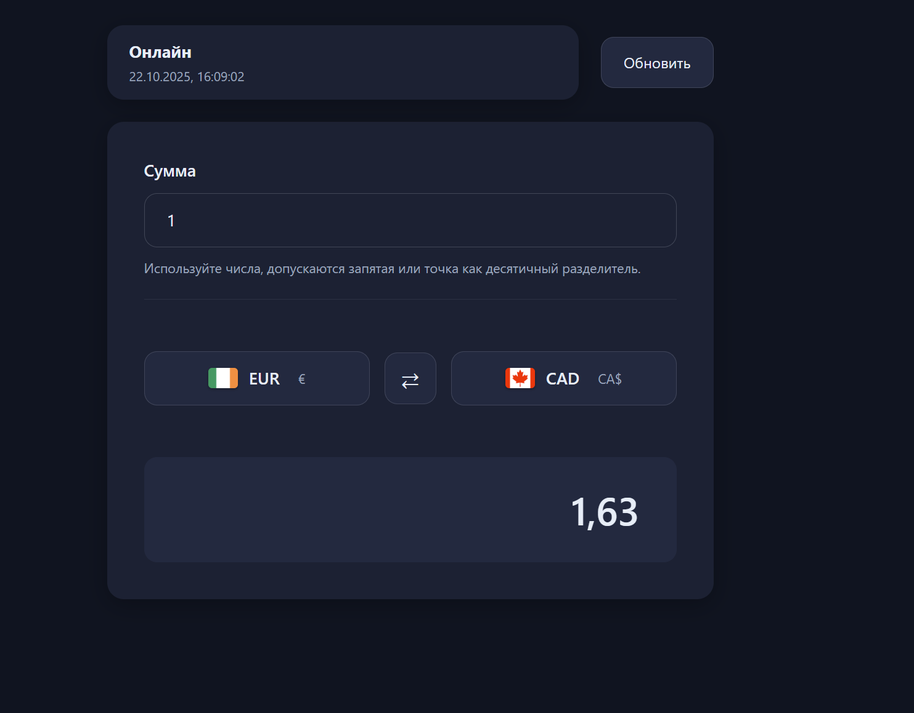
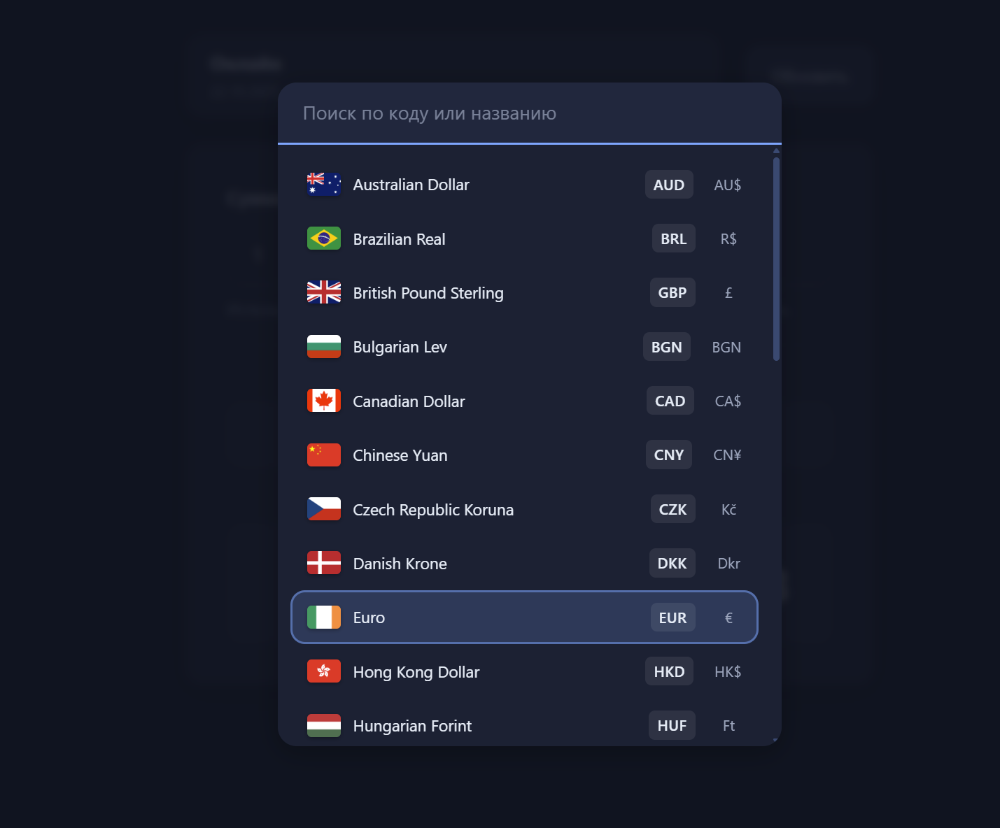
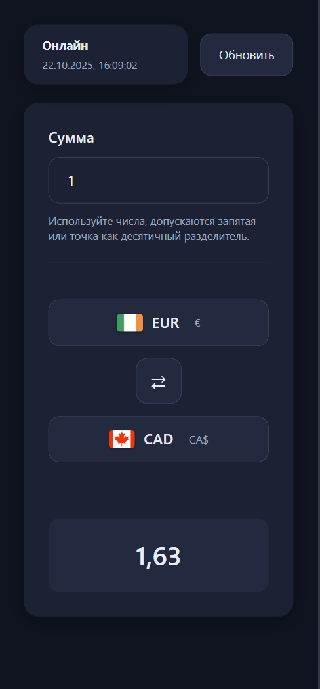
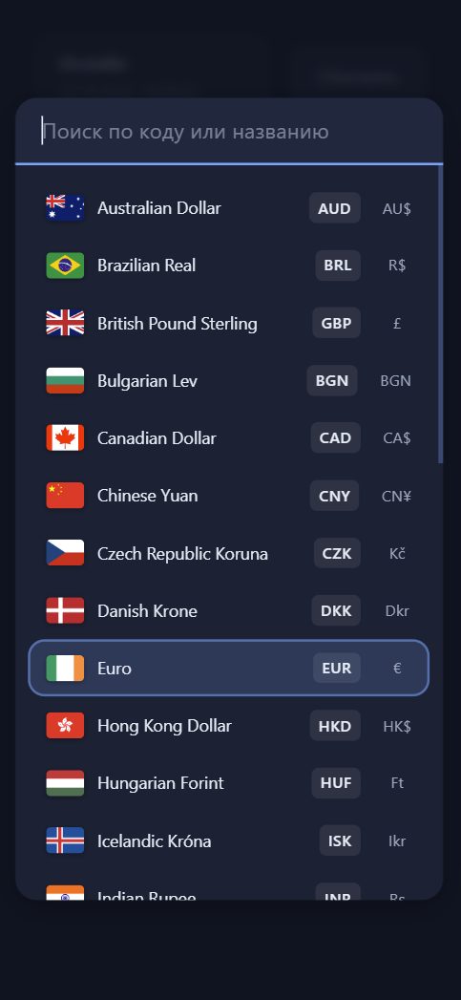

# Конвертер валют — React + TypeScript

Современное веб-приложение для конвертации валют в реальном времени с поддержкой кеширования, офлайн-режима и адаптивного дизайна.

**Демо:** [https://4-theta-lake.vercel.app/](https://4-theta-lake.vercel.app/)

---

## Возможности

| Функция | Описание |
|---------|----------|
| Live-конвертация | Мгновенный пересчёт валют с актуальными курсами |
| Дебаунс 250 мс | Исключает лишние пересчёты при вводе |
| Swap-кнопка | Мгновенно меняет валюты местами |
| Кеш на 5 минут | Данные хранятся в LocalStorage с TTL |
| Офлайн-режим | При потере сети используются закешированные данные |
| Поиск валюты | По коду или названию |
| Клавиатурная навигация | Поддержка Enter / Esc / ↑ / ↓ |
| Адаптивный интерфейс | Оптимизация под мобильные и десктопы |
| Русский интерфейс | Полная локализация и поддержка рубля |

---

## Скриншоты интерфейса

### Десктоп


### Модальное окно выбора валют


### Мобильная версия


### Модальное окно выбора валют


---

## Технологический стек

- React 18 + TypeScript
- Vite
- Vitest + React Testing Library
- LocalStorage TTL Cache
- AbortController + Retry
- React.lazy + Suspense
- ARIA + A11y
- CSS Variables + Responsive Design

---

## Архитектура проекта

```
src/
├── api/            # Работа с API (fetch, обработка, нормализация)
├── app/            # Провайдеры (сеть, состояние приложения)
├── components/     # Универсальные UI-компоненты
├── features/       # Основной экран конвертера
├── hooks/          # Хуки: кеш, дебаунс, обмен курсами
├── lib/            # Утилиты: конвертация, форматирование, поиск
├── data/           # Список валют (currencies.json)
├── styles/         # Глобальные стили, брейкпоинты
└── tests/          # Unit и интеграционные тесты
```

---

## Как запустить локально

### Требования

* Node.js 18+ (LTS)

### Команды

```bash
# Установка зависимостей
npm install

# Запуск dev-сервера
npm run dev

# Сборка production
npm run build

# Тестирование
npm run test

# Линтинг и форматирование
npm run lint
npm run format
```
